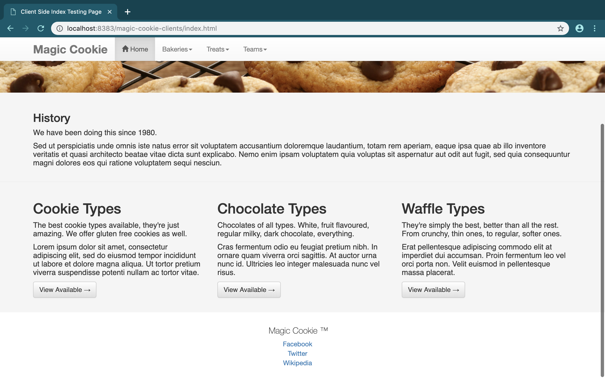
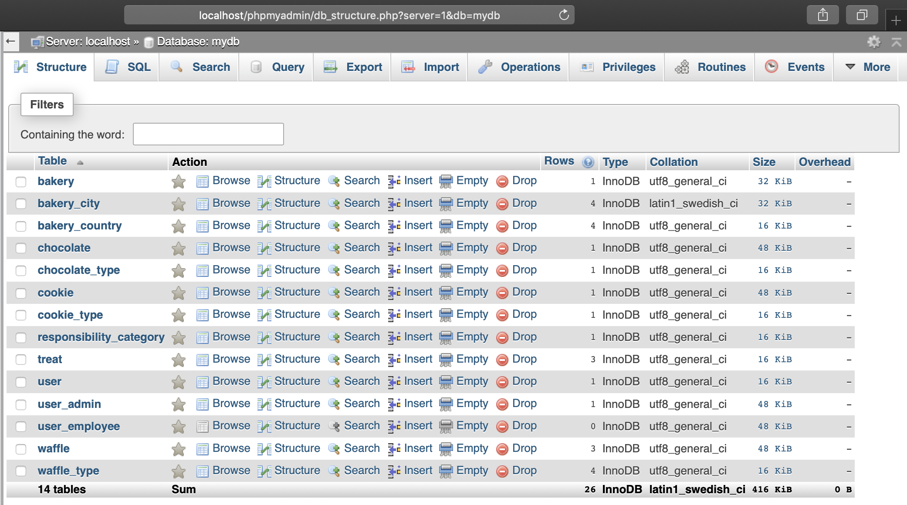
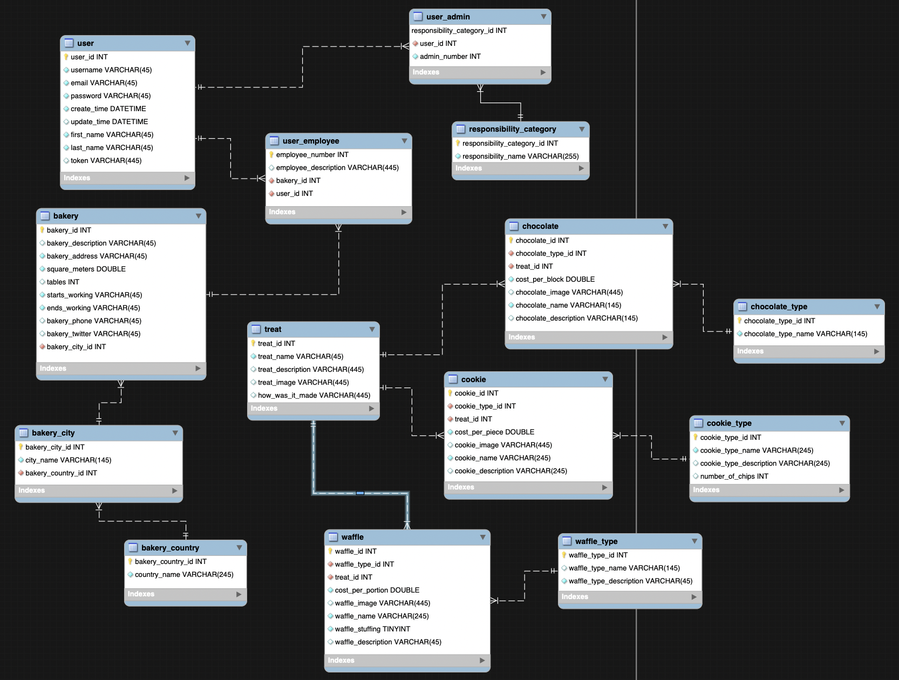
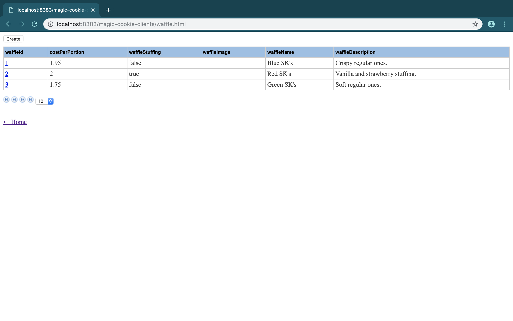

# Magic Cookie 🍪
### A Java RESTful web service.

* An online system for an imaginary bakery.
* MySQL database called <b>mydb.sql</b>, modeled and refined in MySQL Workbench and PhpMyAdmin.
* Made in NetBeans IDE.
* Database UML is provided, the <b>cookie_waffle_chocolate_store.mwb</b> file.
* Divided into the client side and the server side.
* No authentication mechanism.

## magic-cookie-clients
The front end, client side of the system. Amalgam of HTML pages and JavaScript files for all the entities in the system.

Using:
1. Tablesorter UI
1. Backbone.js
1. Twitter Bootstrap 

Just a basic front end for the RESTful web services. I kinda like the UI.

## magic-cookie-services
The back end, server side of the system. Amalgam of entity classes, facade and facade REST classes for the persistence of the system.

Generated by NetBeans using the database of the system. Deployed with Glassfish 4.0 application server. I think the MySQL connector will also be needed for a successful deployment of these services, if I remember correctly.

## Problems ⚠️
Some GET and POST request results won't be presented properly or not at all because of backbone.js, I think. Whenever there's a requests regarding an entity that has a **date format** or some **secondary keys** in it, the front end just can't process it, even though the server side functionalities work perfectly, as I have **tested** the HTTP requests **independently**.

#### Project results:
<h6>Home Page &#x2198;</h6>

<h6>Types View &#x2198;</h6>

<h6>PhpMyAdmin Database View &#x2198;</h6>

<h6>MySQL Workbench Database View &#x2198;</h6>

<h6>Waffles Page &#x2198;</h6>

