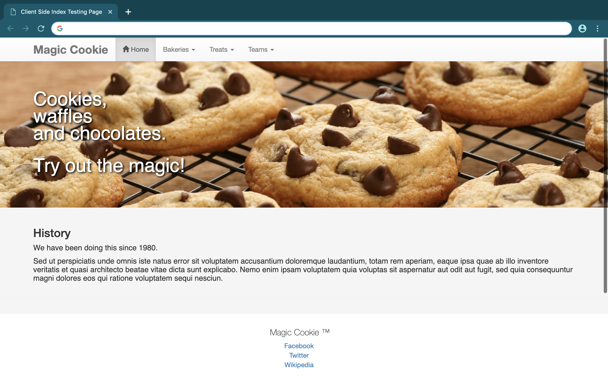

# magic-cookie 🍪
### A Java RESTful web service.

* An online system for an imaginary bakery.
* MySQL database called <b>mydb.sql</b>, modeled and refined in MySQL Workbench and PhpMyAdmin.
* Made in NetBeans IDE.
* Database UML is provided, the <b>cookie_waffle_chocolate_store.mwb</b> file.
* Divided into the client side and the server side.

## magic-cookie-clients
The front end, client side of the system. Amalgam of HTML pages and JavaScript files for all the entities in the system.

Using:
1. Tablesorter UI
1. Backbone.js
1. Twitter Bootstrap 

Just a basic frontend side for the RESTful web services.

## magic-cookie-services
The back end, server side of the system. Amalgam of entity classes, facade and facade REST classes for the persistence of the system.

Generated by NetBeans using the database of the system. Deployed with Glassfish 4.0 application server. I think the MySQL connector will also be needed for a successful deployment of these services, if I remember correctly.

#### Project results:
<h6>View 1</h6>

<h6>View 2</h6>

<h6>View 3</h6>

<h6>View 4</h6>

<h6>View 5</h6>

